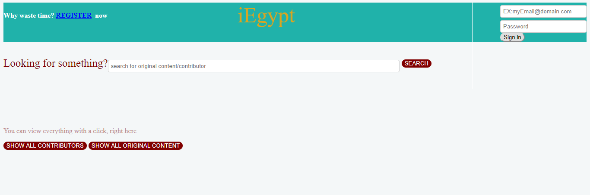
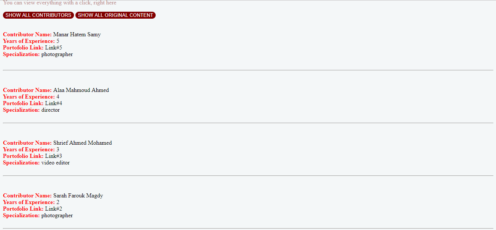
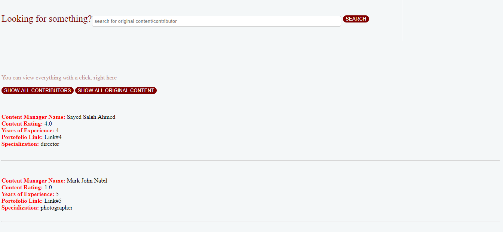
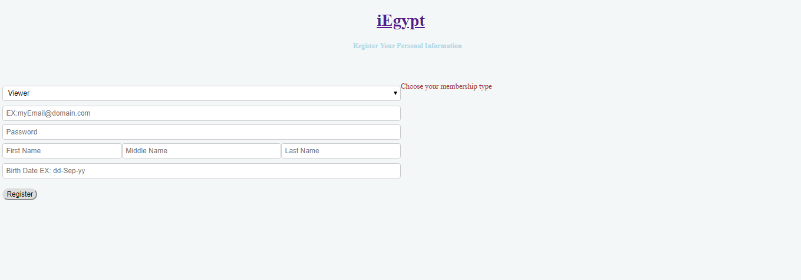
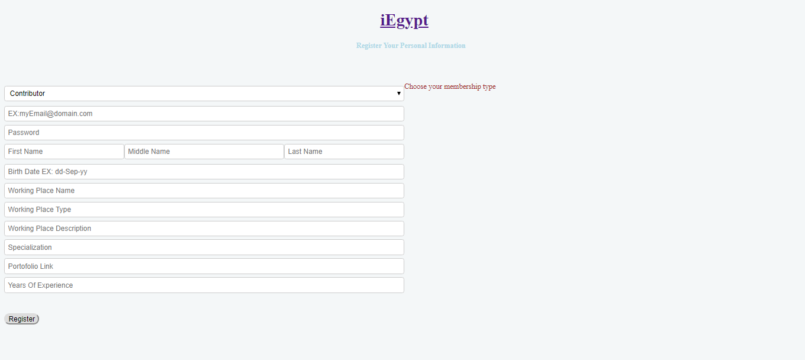
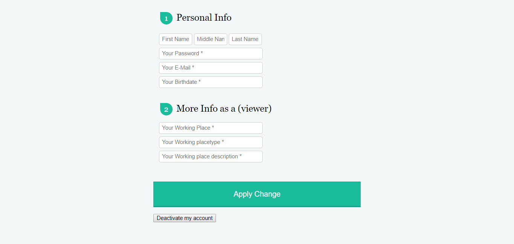
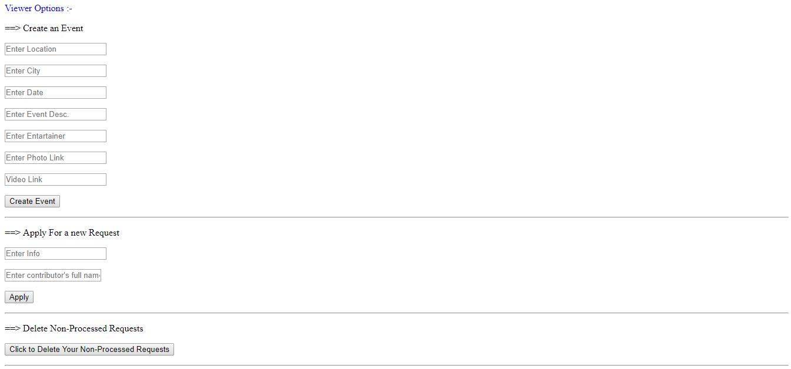
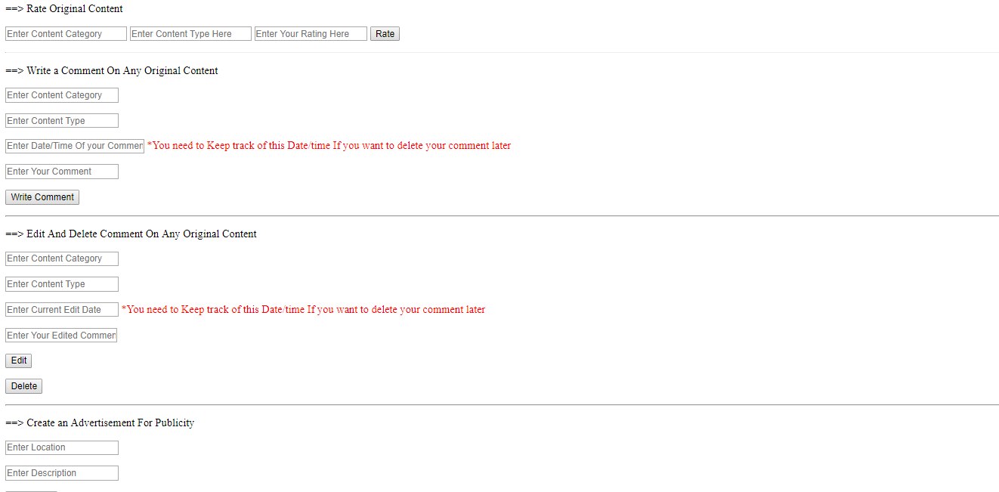
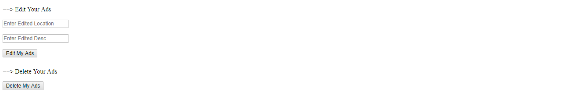
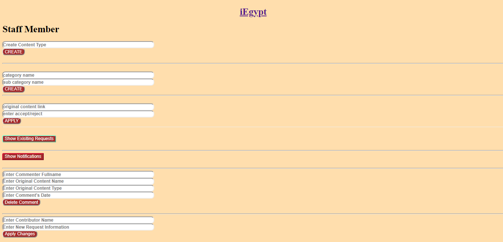

<h1> iEgypt !</h1>
<h3>Introduction</h3>

> 
This is a database project which emulates a social platform for
> photographers to distribute and sell their unique art. In addition to
> registered contributors can be requested to do a
> specific job accordingly by regular users(viewers). 

<h4>Technology stack:</h4>

 - C#
 - ASP.NET
 - SQL
 - HTML

<h4>Some screenshots for the website:</h4>

